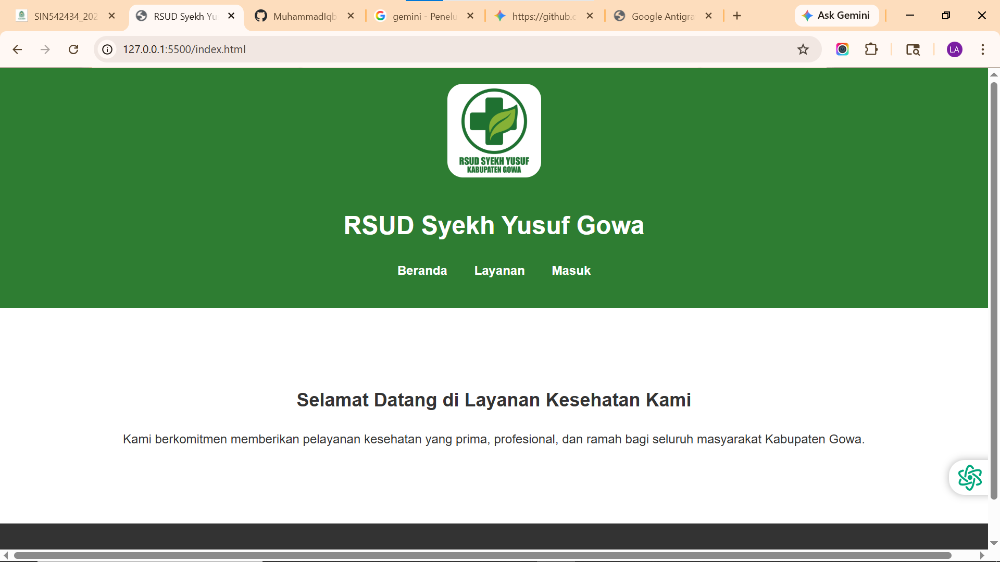
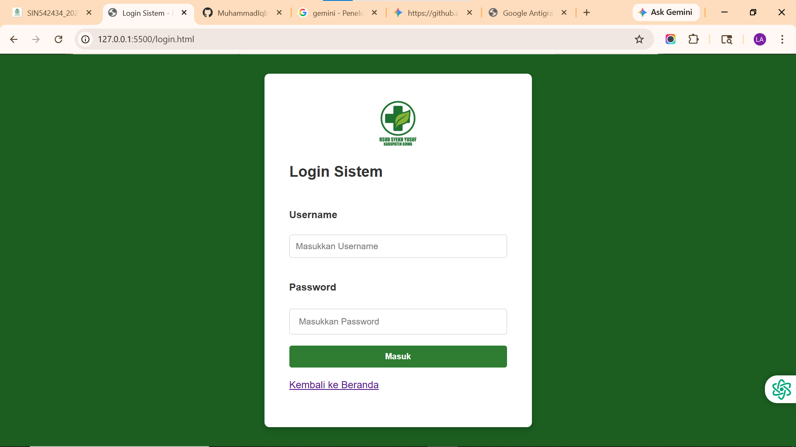
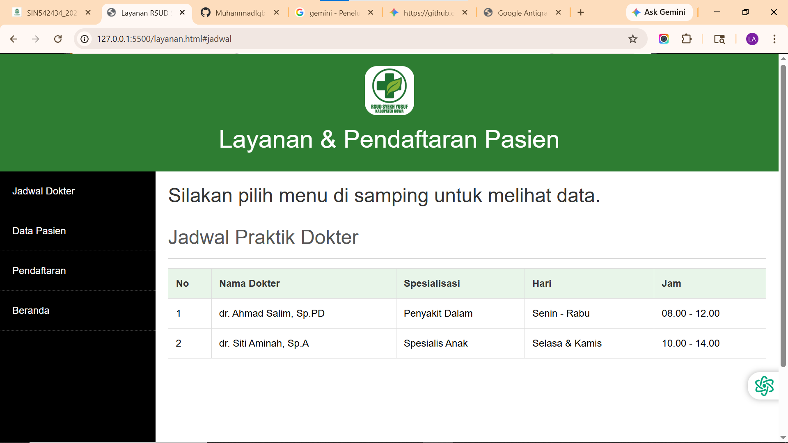
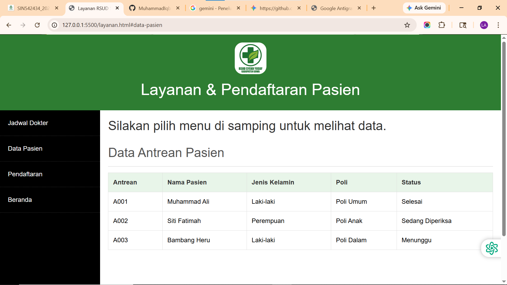
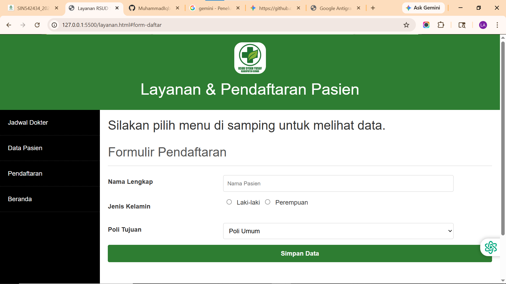

# UTS Pemrograman Web - Sistem Informasi RSUD Syekh Yusuf Gowa

## Deskripsi Proyek
Proyek ini merupakan tugas Ujian Tengah Semester (UTS) untuk mata kuliah Pemrograman Web pada Semester 4. Aplikasi web ini adalah bentuk simulasi prototipe antarmuka frontend untuk sistem informasi rumah sakit **RSUD Syekh Yusuf Gowa**.

## Fitur Utama
1. **Halaman Beranda (`index.html`)**
   Halaman utama yang menampilkan ucapan selamat datang serta navigasi ke halaman lain.
2. **Halaman Layanan & Pendaftaran (`layanan.html`)**
   Halaman fungsional bagi pasien atau staf yang memuat:
   - **Jadwal Praktik Dokter**: Menampilkan daftar dokter, spesialisasi, dan jadwal praktiknya.
   - **Data Antrean Pasien**: Menampilkan daftar pasien yang sedang antre, menunggu, atau telah selesai diperiksa.
   - **Formulir Pendaftaran**: Form statis simulasi pendaftaran pasien baru berdasarkan poly tujuan.
3. **Halaman Login (`login.html`)**
   Halaman simulasi otentikasi login untuk staf atau admin rumah sakit.

## Teknologi yang Digunakan
- **HTML5** untuk struktur dan semantik halaman web.
- **CSS3** (file lokal di `css/style.css`) untuk styling kostum.
- **Bootstrap 5** (via CDN) untuk tata letak dan komponen pendukung yang responsif.

## Cara Menjalankan Proyek
Karena proyek ini berbasis frontend statis (HTML & CSS), Anda tidak memerlukan server khusus (seperti XAMPP/Apache) untuk menjalankannya.

1. Buka folder direktori proyek ini (`TUGAS SEMESTER 4/UTS WEB/`).
2. Klik ganda pada file `index.html` untuk membukanya di browser (Google Chrome, Mozilla Firefox, dll).
3. Gunakan navigasi yang tersedia pada header web untuk berpindah antar halaman layanan dan login.

## Struktur Direktori Proyek
```text
UTS WEB/
├── css/
│   └── style.css            # File spesifik custom CSS
├── resource/                # Direktori aset, berisi gambar dan logo 
│                            # (seperti rsud-syekh-yusuf-gowa-logo)
├── index.html               # File utama / Halaman Beranda
├── layanan.html             # Halaman Jadwal, Antrean, dan Form
├── login.html               # Halaman Login pengguna
└── README.md                # Dokumentasi proyek (file ini)
```

## Tentang
Proyek ini dibuat murni untuk memenuhi kriteria akademik tugas UTS mata kuliah Pemrograman Web Semester 4.

## Output
1. Landing Page

3. Halaman Login

2. Halaman Layanan - Jadwal Dokter

4. Halaman Layanan - Antrean Pasien

5. Halaman Layanan - Formulir Pendaftaran
